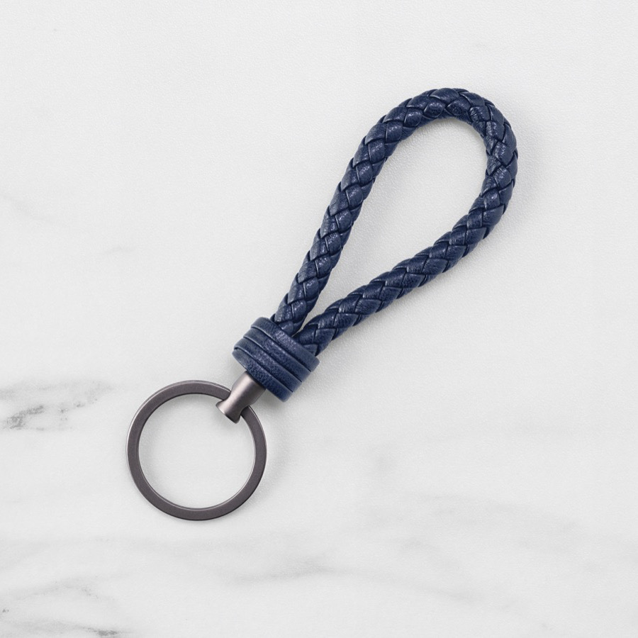

3. Add a navigation drawer
When the user signs in, a homepage is revealed that says, "You did it!" That's great! But now our user needs actions to take and a sense of where they are in the app. To help with that, let's add navigation.

Navigation refers to the components, interactions, visual cues, and information architecture that enable users to move through an app or site. It helps make content and features discoverable, so that tasks are easy to complete.

Material Design navigation patterns offer a high degree of usability. The Material navigation drawer provides navigation and quick access to other actions. Let's add one.

Install MDC Drawer and List
To install the packages for the drawer component, run:

npm install @material/drawer@0.40.0 @material/list@0.40.0
Note: We install the list component in addition to drawer, because the drawer's markup makes use of the list component for its navigation items.

Add the HTML
In home.html, replace "You did it!" with the following markup for the drawer and its items:

<aside class="mdc-drawer shrine-drawer">
  

    <svg class="shrine-logo-drawer" version="1.1" xmlns="http://www.w3.org/2000/svg" xmlns:xlink="http://www.w3.org/1999/xlink" x="0px" y="0px"
       width="48px" height="48px" viewBox="0 0 24 24" enable-background="new 0 0 24 24" xml:space="preserve" fill="#000000" focusable="false">
      <g>
        <g>
          <path d="M17,2H7L2,6.62L12,22L22,6.62L17,2z M16.5,3.58l3.16,2.92H16.5V3.58z M7.59,3.5H15v3H4.34L7.59,3.5z
             M11.25,18.1L7.94,13h3.31V18.1z M11.25,11.5H6.96L4.69,8h6.56V11.5z M16.5,12.32 M12.75,18.09V8h6.56L12.75,18.09z"/>
        </g>
        <rect fill="none" width="24" height="24"/>
      </g>
    </svg>
    <h1 class="shrine-title">SHRINE</h1>
  

  

    <nav class="mdc-list">
      <a class="mdc-list-item mdc-list-item--activated" aria-selected="true" href="#">
        Featured
      </a>
      <a class="mdc-list-item" href="#">
        Apartment
      </a>
      <a class="mdc-list-item" href="#">
        Accessories
      </a>
      <a class="mdc-list-item" href="#">
        Shoes
      </a>
      <a class="mdc-list-item" href="#">
        Tops
      </a>
      <a class="mdc-list-item" href="#">
        Bottoms
      </a>
      <a class="mdc-list-item" href="#">
        Dresses
      </a>
      <a class="mdc-list-item" href="#">
        My Account
      </a>
    </nav>
  

</aside>
Add the CSS
In home.scss, add the following import statements after the existing import:

@import "@material/drawer/mdc-drawer";
@import "@material/list/mdc-list";
At the bottom of home.scss, add the following styles:

.shrine-logo-drawer {
  display: block;
  width: 48px;
  padding: 40px 0 0;
  margin: 0 auto;
  fill: currentColor;
}

.shrine-title {
  text-align: center;
  margin: 5px auto;
}
For this codelab, you only need the base styles for the drawer and list components. You'll have a chance to customize these components in MDC 103: Material Design Theming with Color, Shape, Elevation and Type.

Add the JavaScript
We need to instantiate the MDC List inside the navigation drawer for proper keyboard navigation. Open home.js, which is currently empty, and add the following code:

import {MDCList} from '@material/list';

new MDCList(document.querySelector('.mdc-list'));
Note: We use the standard Navigation Drawer variant in this codelab. The standard variant has no drawer-specific logic, so we instantiate the MDCList inside of it directly. Dismissible and modal variants also exist, which use a dedicated MDCDrawer component for additional features. You can find out more about the MDC Navigation Drawer variants in the documentation.

Refresh the page at http://localhost:8080/home.html. Your home page should now look like this:

Install MDC Image List
To install the package for the image list component, run:

npm install @material/image-list@0.40.0
Add the HTML for a list with one item
Let's start by adding an image list next to the navigation drawer. We'll start the list by adding a single item, which consists of an image and a text label.

In home.html, add the following HTML after the end of the <aside> element:

<ul class="mdc-image-list product-list">
  <li class="mdc-image-list__item">
    
    

      Weave keyring
    

  </li>
</ul>
The list includes an additional class, product-list, which will apply custom styles, both in this tutorial and in MDC-103.

Add the CSS
First, in home.scss, add an import for the image list component styles after the existing imports:

@import "@material/image-list/mdc-image-list";
Next, add the following styles after the initial home page styles:

.product-list {
  @include mdc-image-list-standard-columns(4);

  overflow: auto;
}
These styles instruct the image list to display images across four columns, ensuring that the image list scrolls independently of the drawer.

Refresh the page. The home page should now look like this:

An image list is intended to display many images in a collection, so let's add more images to better see how the component works.

In home.html, copy the existing <li> element:

  <li class="mdc-image-list__item">
    
    

      Weave keyring
    

  </li>
Then paste it after the existing item (before the closing </ul> tag) 15 times. This will result in a total of 16 images. Don't worry about unique images and titles yet; you'll get to those in MDC-103.

Refresh. Now the home page should look like this:

The image list displays four images per row, and the images automatically size to fit the available screen space.